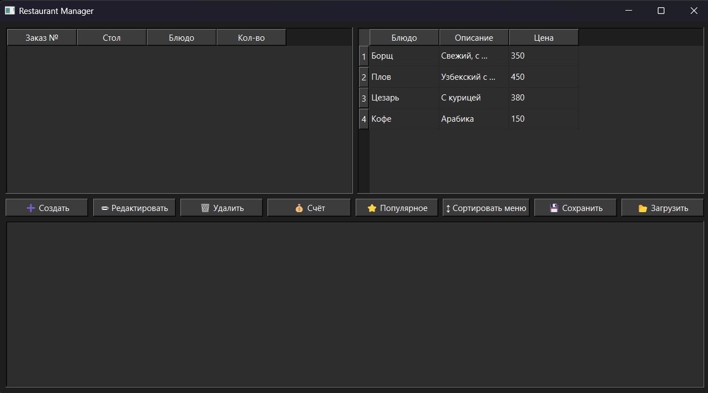

# Справочник Use Cases для приложения Restaurant Manager

### Use Case 1: Добавление нового заказа с валидными данными
Описание: Пользователь добавляет новый заказ, вводя корректные данные.
Шаги:

Нажмите кнопку "➕ Создать".
В открывшемся диалоге:
В поле "Номер заказа" введите "5" (уникальный номер, не совпадающий с существующими).
В поле "Стол" введите "3".
В выпадающем списке "Блюдо" выберите "Плов".
В поле "Количество" введите "2".

Нажмите "OK".
Ожидаемый результат:

Диалог закроется.
В левой таблице (заказы) появится новая строка: Заказ №: 5, Стол: 3, Блюдо: Плов, Кол-во: 2.
В логе (внизу) появится сообщение: "Заказ создан.".
Правая таблица (меню) не изменится.

###  Use Case 2: Добавление заказа с невалидными данными (дублирующийся номер)
Описание: Пользователь пытается добавить заказ с номером, который уже существует, чтобы проверить валидацию.
Шаги:

Предположим, в таблице заказов уже есть заказ с номером "1" (добавьте его предварительно через Use Case 1, если нужно).
Нажмите "➕ Создать".
В диалоге:
Номер заказа: "1" (дубликат).
Стол: "4".
Блюдо: "Цезарь".
Количество: "1".

Нажмите "OK".
Ожидаемый результат:

Появится предупреждение (QMessageBox): "Ошибка" с текстом "Заказ с таким номером уже существует!".
Диалог не закроется, заказ не добавится.
Таблица заказов и лог не изменятся.

###  Use Case 3: Редактирование существующего заказа
Описание: Пользователь изменяет данные в существующем заказе.
Шаги:

Добавьте заказ через Use Case 1 (например, №5, Стол 3, Плов, 2).
Выделите строку с заказом №5 в левой таблице (кликните на нее).
Нажмите "✏ Редактировать".
В диалоге:
Измените "Стол" на "5".
Измените "Блюдо" на "Борщ".
Измените "Количество" на "3".
Номер заказа оставьте "5" (он не должен изменяться, но если измените — проверьте на дубликат).

Нажмите "OK".
Ожидаемый результат:

Диалог закроется.
В левой таблице строка обновится: Заказ №: 5, Стол: 5, Блюдо: Борщ, Кол-во: 3.
В логе: "Заказ изменён.".
Если изменили номер на существующий — появится ошибка как в Use Case 2.

### Use Case 4: Удаление заказа
Описание: Пользователь удаляет выбранный заказ после подтверждения.
Шаги:

Добавьте заказ (например, №6, Стол 1, Кофе, 1).
Выделите строку с №6 в левой таблице.
Нажмите "🗑 Удалить".
В появившемся окне подтверждения ("Удаление" с текстом "Удалить выбранный заказ?") нажмите "Yes".
Ожидаемый результат:

Строка удалится из левой таблицы.
В логе: "Заказ удалён.".
Если нажать "No" — ничего не изменится, лог пустой.

###  Use Case 5: Расчет счета для стола
Описание: Пользователь рассчитывает общую сумму для выбранного стола.
Шаги:

Добавьте несколько заказов на один стол: например, №7 (Стол 2, Борщ, 1), №8 (Стол 2, Плов, 2).
Выделите любую строку с Стол 2 (например, №7).
Нажмите "💰 Счёт".
Ожидаемый результат:

В логе появится сообщение: "\nСчёт по столику №2: [сумма] руб." (например, 350 + 450*2 = 1250 руб., на основе цен из меню).
Таблицы не изменятся.
Если заказов на столе нет — сумма 0 (но код считает только по заказам).

###  Use Case 6: Просмотр популярных блюд
Описание: Пользователь выводит список популярных блюд на основе заказов.
Шаги:

Добавьте заказы: №9 (Борщ, 1), №10 (Борщ, 2), №11 (Плов, 1).
Нажмите "⭐ Популярное".
Ожидаемый результат:

В логе: "\nПопулярные блюда:" followed by "- Борщ" (как самое заказанное; код возвращает блюда с max количеством).
Если несколько с равным — все перечислены.
Таблицы не изменятся.

### Use Case 7: Сортировка меню по цене
Описание: Пользователь сортирует меню по возрастанию цены.
Шаги:

Убедитесь, что меню не отсортировано (по умолчанию: Борщ 350, Плов 450, Цезарь 380, Кофе 150).
Нажмите "↕ Сортировать меню".
Ожидаемый результат:

Правая таблица обновится: строки в порядке по цене (Кофе 150, Борщ 350, Цезарь 380, Плов 450).
В логе: "Меню отсортировано по цене.".
Левая таблица не изменится.

### Use Case 8: Сохранение заказов в файл
Описание: Пользователь сохраняет список заказов в TXT-файл.
Шаги:

Добавьте заказы (например, 2-3 штуки).
Нажмите "💾 Сохранить".
В диалоге сохранения выберите путь и имя (например, "orders.txt").
Нажмите "Save".
Ожидаемый результат:

Файл создастся с содержимым (формат из FileManager::saveOrders, вероятно, ID;Table;Dish;Count по строкам).
В логе: "Файл сохранён.".
Если отменить — лог пустой.

### Use Case 9: Загрузка заказов из файла
Описание: Пользователь загружает заказы из ранее сохраненного файла.
Шаги:

Сохраните заказы через Use Case 8.
Очистите таблицу (удалите все заказы).
Нажмите "📂 Загрузить".
Выберите файл "orders.txt".
Нажмите "Open".
Ожидаемый результат:

Левая таблица заполнится загруженными заказами.
В логе: "Файл загружен.".
Если файл пустой — таблица пустая.

### Use Case 10: Попытка редактирования без выбора строки
Описание: Пользователь пытается редактировать заказ без выделения, чтобы проверить обработку ошибок.
Шаги:

Убедитесь, что ни одна строка в левой таблице не выделена (кликните вне таблицы).
Нажмите "✏ Редактировать".
Ожидаемый результат:

Ничего не произойдет (диалог не откроется, на основе кода: if (row < 0) return;).
Лог не изменится, нет сообщений об ошибке.
Таблицы остаются как есть.

### Use Case 11: Попытка удаления без выбора
Нажмите "🗑 Удалить" без выделения строки — ничего не происходит, нет ошибок.
### Use Case 12: Расчет счета без выбора заказа
Нажмите "💰 Счёт" без выделения — ничего не происходит (код проверяет row < 0).
### Use Case 13: Загрузка несуществующего или поврежденного файла
Выберите невалидный файл в диалоге — лог "Файл загружен.", но таблица может не измениться или частично заполниться.
### Use Case 14: Добавление заказа с нулевым количеством
В диалоге укажите "Количество: 0" — заказ добавится, но сумма в счете будет 0 (нет валидации).
### Use Case 15: Просмотр популярных без заказов
Нажмите "⭐ Популярное" с пустой таблицей заказов — в логе пустой список популярных.